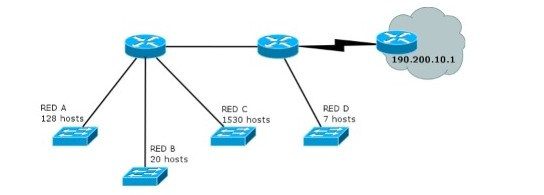

# PRACTICA 7 - Capa de Red - Direccionamiento
 
 14. Suponga que trabaja en una organización que tiene la red que se ve en el gráfico y debe armar el
direccionamiento para la misma, minimizando el desperdicio de direcciones IP. 
Dicha organización posee
la red 205.10.192.0/19, que es la que usted deberá utilizar.

<!--como imagen local-->



**a. ¿Es posible asignar las subredes correspondientes a la topología utilizando subnetting sin vlsm?
Indique la cantidad de hosts que se desperdicia en cada subred.**

a. No, no es posible debido a que como mínimo necesito 5 redes, y si hago esta división no me alcanzaría la cantidad de hosts para la red C.

Cantidad de hosts que se desperdicia en cada subred: 

|  RED  | HOST DESPERDICIADOS |
| :---: | :-----------------: |
|   A   |         126         |
|   B   |         10          |
|   C   |         516         |
|   D   |          7          |

___

**b. Asigne direcciones a todas las redes de la topología. Tome siempre en cada paso la primer dirección
de red posible.**

| SUBRED | HOST SOLICITADOS |  RED  |
| :----: | :--------------: | :---: |
|   1    |       1530       |   C   |
|   2    |       128        |   A   |
|   3    |        20        |   B   |
|   4    |        7         |   D   |

##### **Subneteo VLSM:**

```
Red: 205.10.192.0/19
Representación en binario: 11001101.00001010.11000000.00000000
Máscara actual: 11111111.11111111.11100000.00000000
```
___

**_Cálculos de subred para 1530 hosts_**
1. _Calcular el numero de bits de host necesarios para 1530 hosts._ 
   * Para realizar este cálculo se utiliza la formula: 
      * **(2^n) - 2 >= H** 
  

        Donde n es el número de bits y H es el numero de hosts de la subred

    Entonces:
    
    * (2^11) - 2 >= 1530 

        2048 - 2 >= 1530
        
        2046 >= 1530 
    
    Por lo tanto 2046 son la cantidad de hosts disponibles.
    

2. _Calcular el numero de bits de subred._
   * Para realizar este cálculo se utiliza la siguiente expresion:
     * **R = (32 - p) - n**
  
        Donde 32 es el número de bits de una dirección IP, p es el prefijo de la red y n es el número de bits de la parte de host calculado en el paso anterior.

    Entonces: 
    
      * R = (32 - 19) - 11
  
        R = 13 - 11 = 2
    
    Por lo tanto hay que tomar prestados 2 bits de la parte de host para obtener una subred de 2046 hosts.


3. _Calcular la nueva máscara de subred._
   
   * El nuevo prefijo se obtiene sumandole R al prefijo original

   Entonces: 
    
    * p = 19 + 2 = 21

    * Nueva máscara: 
    
      * Representación en binario: 11111111.11111111.11111000.00000000
    
      * Representación en decimal: 255.255.248.0
    

4. _Calcular salto de red._ 
   * El salto de red es la diferencia entre 2 direcciones de red consecutivas y se calcula como la diferencia de 256 y el último octeto no nulo de la máscara.
  
   Entonces:

   * S = 256 - 248 = 8 

   El resultado de S se utilizara para conocer la siguiente dirección de red.


5. _Calcular párametros de red._ 
   * La dirección de la 1° subred siempre es igual a la dirección de red original:  
     * ```205.10.192.0```
   * La dirección de 1° host se consigue sumando 1 a la dirección de red: 
     * ```205.10.192.1```
   * La dirección del último host se consigue sumando a la dirección de red el número de host de la subred: 
     * ```205.10.199.254```
   * La dirección broadcast se consigue sumando 1 a la dirección del último host: 
     * ```205.10.199.255```
   * La dirección de la siguiente subred, se puede calcular sumando 1 a la dirección de broadcast o bien sumando a la dirección de red el salto de red:
     * ```205.10.200.0```
___
**_Cálculos de subred para 128 hosts_**
1. _Calcular el numero de bits de host necesarios para 128 hosts._ 
   * Para realizar este cálculo se utiliza la formula: 
      * **(2^n) - 2 >= H** 
  

        Donde n es el número de bits y H es el numero de hosts de la subred

    Entonces:
    
    * (2^8) - 2 >= 128 

        256 - 2 >= 128
        
        254 >= 128 
    
    Por lo tanto 254 son la cantidad de hosts disponibles.
    

2. _Calcular el numero de bits de subred._
   * Para realizar este cálculo se utiliza la siguiente expresion:
     * **R = (32 - p) - n**
  
        Donde 32 es el número de bits de una dirección IP, p es el prefijo de la red y n es el número de bits de la parte de host calculado en el paso anterior.

    Entonces: 
    
      * R = (32 - 19) - 8
  
        R = 13 - 8 = 5
    
    Por lo tanto hay que tomar prestados 5 bits de la parte de host para obtener una subred de 128 hosts.


3. _Calcular la nueva máscara de subred._
   
   * El nuevo prefijo se obtiene sumandole R al prefijo original

   Entonces: 
    
    * p = 19 + 5 = 24

    * Nueva máscara: 
    
      * Representación en binario: ```11111111.11111111.11111111.00000000```
    
      * Representación en decimal: ```255.255.255.0```
    

4. _Calcular salto de red._ 
   * El salto de red es la diferencia entre 2 direcciones de red consecutivas y se calcula como la diferencia de 256 y el último octeto no nulo de la máscara.
  
   Entonces:

   * S = 256 - 255 = 1

   El resultado de S se utilizara para conocer la siguiente dirección de red.


5. _Calcular párametros de red._ 
   * La dirección de la 1° subred siempre es igual a la dirección de red original:  
     * ```205.10.200.0```
   * La dirección de 1° host se consigue sumando 1 a la dirección de red: 
     * ```205.10.200.1```
   * La dirección del último host se consigue sumando a la dirección de red el número de host de la subred: 
     * ```205.10.200.254```
   * La dirección broadcast se consigue sumando 1 a la dirección del último host: 
     * ```205.10.200.255```
   * La dirección de la siguiente subred, se puede calcular sumando 1 a la dirección de broadcast o bien sumando a la dirección de red el salto de red:
     * ```205.10.201.0```
___

**_Cálculos de subred para 20 hosts_**
1. _Calcular el numero de bits de host necesarios para 20 hosts._ 
   * Para realizar este cálculo se utiliza la formula: 
      * **(2^n) - 2 >= H** 
  

        Donde n es el número de bits y H es el numero de hosts de la subred

    Entonces:
    
    * (2^5) - 2 >= 20 

        32 - 2 >= 20
        
        30 >= 20 
    
    Por lo tanto 30 son la cantidad de hosts disponibles.
    

2. _Calcular el numero de bits de subred._
   * Para realizar este cálculo se utiliza la siguiente expresion:
     * **R = (32 - p) - n**
  
        Donde 32 es el número de bits de una dirección IP, p es el prefijo de la red y n es el número de bits de la parte de host calculado en el paso anterior.

    Entonces: 
    
      * R = (32 - 19) - 5
  
        R = 13 - 5 = 8
    
    Por lo tanto hay que tomar prestados 8 bits de la parte de host para obtener una subred de 20 hosts.


3. _Calcular la nueva máscara de subred._
   
   * El nuevo prefijo se obtiene sumandole R al prefijo original

   Entonces: 
    
    * p = 19 + 8 = 27

    * Nueva máscara: 
    
      * Representación en binario: ```11111111.11111111.11111111.11100000```
    
      * Representación en decimal: ```255.255.255.224```
    

4. _Calcular salto de red._ 
   * El salto de red es la diferencia entre 2 direcciones de red consecutivas y se calcula como la diferencia de 256 y el último octeto no nulo de la máscara.
  
   Entonces:

   * S = 256 - 224 = 32

   El resultado de S se utilizara para conocer la siguiente dirección de red.


5. _Calcular párametros de red._ 
   * La dirección de la 1° subred siempre es igual a la dirección de red original:  
     * ```205.10.201.0```
   * La dirección de 1° host se consigue sumando 1 a la dirección de red: 
     * ```205.10.201.1```
   * La dirección del último host se consigue sumando a la dirección de red el número de host de la subred: 
     * ```205.10.201.30```
   * La dirección broadcast se consigue sumando 1 a la dirección del último host: 
     * ```205.10.201.31```
   * La dirección de la siguiente subred, se puede calcular sumando 1 a la dirección de broadcast o bien sumando a la dirección de red el salto de red:
     * ```205.10.201.32```
___

**_Cálculos de subred para 7 hosts_**
1. _Calcular el numero de bits de host necesarios para 20 hosts._ 
   * Para realizar este cálculo se utiliza la formula: 
      * **(2^n) - 2 >= H** 
  

        Donde n es el número de bits y H es el numero de hosts de la subred

    Entonces:
    
    * (2^4) - 2 >= 7 

        16 - 2 >= 7
        
        14 >= 7
    
    Por lo tanto 7 son la cantidad de hosts disponibles.
    

2. _Calcular el numero de bits de subred._
   * Para realizar este cálculo se utiliza la siguiente expresion:
     * **R = (32 - p) - n**
  
        Donde 32 es el número de bits de una dirección IP, p es el prefijo de la red y n es el número de bits de la parte de host calculado en el paso anterior.

    Entonces: 
    
      * R = (32 - 19) - 4
  
        R = 13 - 4 = 8
    
    Por lo tanto hay que tomar prestados 8 bits de la parte de host para obtener una subred de 7 hosts.


3. _Calcular la nueva máscara de subred._
   
   * El nuevo prefijo se obtiene sumandole R al prefijo original

   Entonces: 
    
    * p = 19 + 8 = 27

    * Nueva máscara: 
    
      * Representación en binario: ```11111111.11111111.11111111.11100000```
    
      * Representación en decimal: ```255.255.255.224```
    

4. _Calcular salto de red._ 
   * El salto de red es la diferencia entre 2 direcciones de red consecutivas y se calcula como la diferencia de 256 y el último octeto no nulo de la máscara.
  
   Entonces:

   * S = 256 - 224 = 32

   El resultado de S se utilizara para conocer la siguiente dirección de red.


5. _Calcular párametros de red._ 
   * La dirección de la 1° subred siempre es igual a la dirección de red original:  
     * ```205.10.201.32```
   * La dirección de 1° host se consigue sumando 1 a la dirección de red: 
     * ```205.10.201.33```
   * La dirección del último host se consigue sumando a la dirección de red el número de host de la subred: 
     * ```205.10.201.46```
   * La dirección broadcast se consigue sumando 1 a la dirección del último host: 
     * ```205.10.201.47```
   * La dirección de la siguiente subred, se puede calcular sumando 1 a la dirección de broadcast o bien sumando a la dirección de red el salto de red:
     * ```205.10.201.48```
    
        No es necesario este calculo porque ya se tienen las 4 subredes pedidas.

___
Tabla:
| SUBRED | HOST SOLICITADOS |   IP DE RED   |     MÁSCARA     | HOST DISPONIBLES |  PRIMER HOST  |  ÚLTIMO HOST   |   BROADCAST    |
| :----: | :--------------: | :-----------: | :-------------: | :--------------: | :-----------: | :------------: | :------------: |
|   1    |       1530       | 205.10.192.0  |  255.255.248.0  |       2046       | 205.10.192.1  | 205.10.199.254 | 205.10.199.255 |
|   2    |       128        | 205.10.200.0  |  255.255.255.0  |       254        | 205.10.200.1  | 205.10.200.254 | 205.10.200.255 |
|   3    |        20        | 205.10.201.0  | 255.255.255.224 |        30        | 205.10.201.1  | 205.10.200.30  | 205.10.201.31  |
|   4    |        7         | 205.10.201.32 | 255.255.255.224 |        7         | 205.10.201.33 | 205.10.201.46  | 205.10.201.47  |
___

**c. Para mantener el orden y el inventario de direcciones disponibles, haga un listado de todas las direcciones libres que le quedaron, agrupándolas utilizando CIDR.**


___
**d. Asigne direcciones IP a todas las interfaces de la topología que sea posible.**

___


